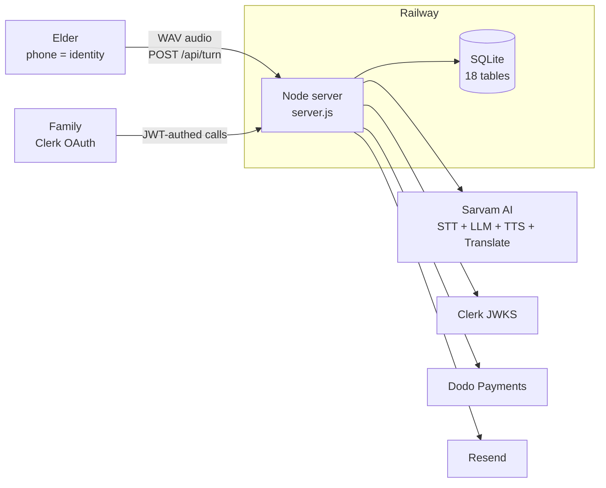
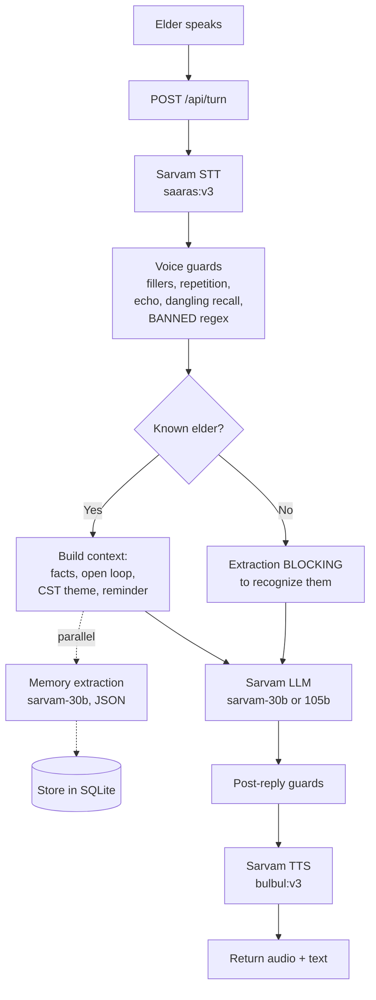
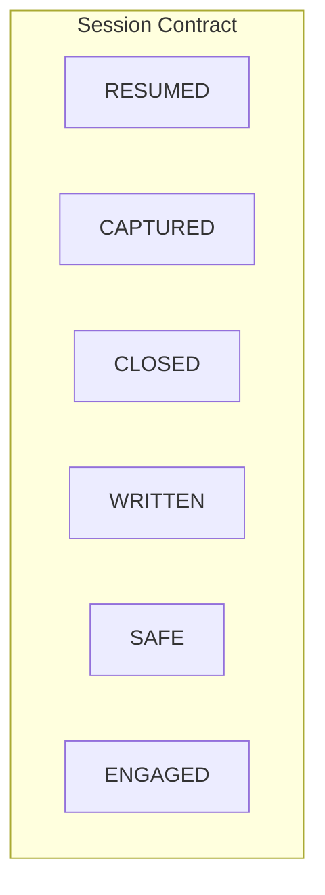
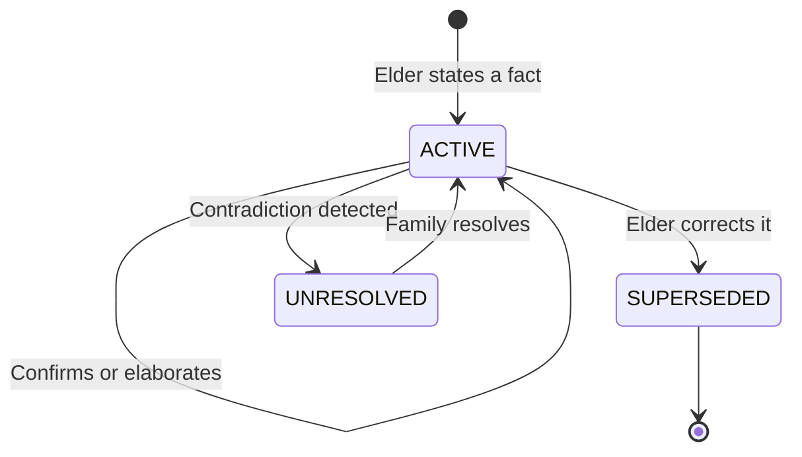

# Yaadein

A voice companion for elders living with memory loss, in the language they speak at home.

The elder taps one button and talks. Yaadein leads the conversation using Cognitive Stimulation Therapy themes, remembers what they said, and never tests their memory. Forgetting is met with warmth, not correction. The family gets a living memoir, clinical session notes, and a sixty-second briefing before each visit.

Built for the Sarvam Epoch Buildathon, July 2026. Every model in the product is Sarvam's.

---

## Architecture

One Node process and a SQLite file. That is the whole production stack.



The elder records audio, taps stop, and the server runs the full pipeline: STT, voice guards, LLM, memory extraction, TTS. Everything in one process, one `handleTurn()` function, one database file.

---

## How a turn works



Two things worth noting here. First, memory extraction runs in parallel with the reply for known elders (so it never adds latency), but runs blocking for unknown elders (so a returning person is recognized in the same turn). Second, the voice guards are enforced in code, not left to the system prompt. The `BANNED` regex catches recall-test phrases (`yaad hai?`, `yaad karo`). If the model's reply leaks a stored fact as a hint, the server regenerates. If regeneration still leaks, it drops the offending sentences. If the reply has no question, `keepTheFloor()` appends one so the conversation never dies.

---

## Sarvam models in use

| Endpoint | Model | Config | Where in the product |
|---|---|---|---|
| `/speech-to-text` | `saaras:v3` | `mode: codemix` | Every voice turn. Elders mix Hindi and English mid-sentence. 11 Indian languages. |
| `/v1/chat/completions` | `sarvam-30b` | `reasoning_effort: null`, `temp: 0.4`, `max_tokens: 160` | Ordinary conversation turns. Thinking disabled for speed. Also used for memory extraction (JSON mode, `temp: 0.1`). |
| `/v1/chat/completions` | `sarvam-105b` | `reasoning_effort: null`, `temp: 0.2-0.4`, `max_tokens: 600-1600` | Stalled recall cues (when the elder says "yaad nahi"), memoir synthesis, Session Scribe clinical reports. The bigger model earns its keep on nuance. |
| `/text-to-speech` | `bulbul:v3` | voice `simran`, pace `0.85`, 24kHz WAV | Slowed from default -- the normal pace is too fast for elders to follow. 11 languages. |
| `/translate` | -- | -- | Openers for non-Hindi elders, memoir translation for English-reading families. Brand name "Yaadein" is split out and reinserted untranslated because Translate was rendering it as Tamil/Marathi words. |

No non-Sarvam model does language work anywhere.

---

## The Session Contract

Every session tracks six signals. The frontend shows them live and they show up in test reports.



| Signal | What trips it |
|---|---|
| `RESUMED` | Context loaded from a previous session for this elder |
| `CAPTURED` | At least one new fact extracted and stored |
| `CLOSED` | Prior open loop resolved or explicitly re-queued |
| `WRITTEN` | Briefing/memoir inputs updated |
| `SAFE` | Set to false if a `BANNED` phrase makes it through all guards |
| `ENGAGED` | Turn count, user word count, elaborated facts |

---

## Memory lifecycle



The family can also set `safe_to_use = false` on any ACTIVE memory via the dashboard, which filters it out of conversation context at retrieval time. This is a flag on the row, not a separate status.

Every memory carries a provenance grade:

- `USER_STATED` -- they volunteered it
- `USER_CONFIRMED` -- the agent proposed it from context and they agreed
- `USER_ELABORATED` -- they added detail beyond what was proposed
- `USER_CORRECTED` -- they corrected a prior fact
- `SESSION_OBSERVED` -- captured during a human-facilitated Session Scribe recording
- `FAMILY_VERIFIED` -- set when a family member resolves an `UNRESOLVED` memory conflict via the dashboard

There is no `AVOIDED` status. Instead, the family can set `safe_to_use = false` on any memory via the dashboard, which filters it out of conversation context at retrieval time. The actual statuses in the DB are `ACTIVE`, `SUPERSEDED`, and `UNRESOLVED`.

Contradictions are detected automatically. When two facts conflict (e.g. "2 children" vs "3 children"), the newer one is stored as a variant, both are marked `UNRESOLVED`, and neither is used in conversation until the family resolves it.

---

## External services

| Service | What it does | How it authenticates | Degrades gracefully? |
|---|---|---|---|
| Sarvam AI | STT, LLM, TTS, Translate. One key. | `api-subscription-key` header | No -- the product is Sarvam |
| Clerk | Family dashboard Google OAuth | RS256 JWT verified against JWKS by hand using `node:crypto`, cached 55min | Yes -- unset means no auth, elder routes never need it |
| Dodo Payments | Family subscriptions, founding seats | Standard Webhooks HMAC-SHA256, verified by hand, 5min replay tolerance | Yes -- unset means webhook returns 503, checkout links just disappear |
| Resend | Seat confirmations, app announcements | API key via `fetch` | Yes -- unset means emails log to console instead |

---

## Repo map

```
app/                         Node.js backend, zero npm dependencies
  server.js                    2194 lines. HTTP server, full API surface, conversation
                               pipeline, memory extraction, session management, Sarvam
                               integration, static SPA serving from landing-page/dist/
  db.js                        SQLite via node:sqlite. 18 tables. Memory deduplication,
                               contradiction detection, provenance tracking, variant
                               versioning, access control (ownsPhone/ownsPerson)
  prompts.js                   System prompt, 5 CST themes (kahavat, shabd_bazaar, swad,
                               duniya, sangeet), orientation line (IST time + season),
                               opener/memoir/briefing/scribe generation prompts
  voice.js                     Code-enforced text guards: filler stripping (Hindi + 10
                               Indian languages), repetition detection, echo detection,
                               dangling recall detection, BANNED recall-test regex,
                               floor-keeping logic. No AI calls in this file.
  clerk.js                     Zero-dep Clerk JWKS: fetches RSA keys, converts JWK to
                               KeyObject, caches 55min, verifies RS256 JWTs
  checkin.js                   Silence monitoring: sweeps on cadence (4h-168h), respects
                               quiet hours (with midnight wrapping), writes missed/resumed
                               events to DB. Has a pluggable dialer slot (setDialer) but
                               nothing connects to it -- check-ins are DB events that the
                               family dashboard reads, not push notifications
  dodo.js                      Dodo payment webhooks: HMAC-SHA256, plan mapping, replay
                               tolerance, constant-time comparison
  email.js                     Resend emails: seat confirmed (founding vs regular), app
                               announcement. Falls back to console.log if no API key
  sim.js                       Scenario simulator: 9 test personas, reply linter (word
                               limit, script fit for 11 Indic scripts, hallucination
                               detection, recall-test ban). Safety prefix 5XXXXXXXXX
  public/                      Fallback HTML pages (family.html, memory.html, favicon)
  .env.example                 Every env var, heavily documented

realtime/                    Pipecat WebRTC sidecar -- NOT IN USE (see note below)
  bot.py                       Scaffolded Pipecat pipeline for streaming voice
  pyproject.toml               pipecat-ai[runner,sarvam,silero,webrtc]==1.6.0

landing-page/                React 19 + TypeScript 6 + Vite 8 + Tailwind CSS v4
  src/
    main.tsx                   Entry point, ClerkProvider, OAuth route recovery
    App.tsx                    Hash router: #/try, #/family, #/waitlist, #/stats, #/home
    lib/
      api.ts                   API base URL
      auth.ts                  Clerk bridge, authFetch with bearer injection
      wav.ts                   16kHz mono PCM16 WAV encoder
    components/
      Orb.tsx                  Canvas-rendered 3D voice orb, state animations
      Phone3D.tsx              Three.js interactive phone render (landing page)
      PhoneGate.tsx            Phone entry + demo claiming dialog
      Auth.tsx                 AuthProvider, RequireFamilySignIn, route recovery
      Confetti.tsx             Waitlist celebration
      ...                      Logo, LangSelect, FeedbackButton, Primitives
    sections/                  Landing page: Hero, Personas, Loop, Experience,
                               Languages, Coverage, Pricing, About, Footer, Nav
    try/
      TryPage.tsx              Elder voice screen entry point
      TryShell.tsx             Shared UI: orb, mic button, captions, contract badges
      TryPageRest.tsx          Record-upload via Web Audio API, client-side VAD,
                               auto-send after 1400ms silence, 25s cap
      TryPageRealtime.tsx      WebRTC path -- exists but never loaded (see note)
      errors.ts                Compassionate error messages for elders (compiled and
                               tested -- every message must name an action)
    family/
      FamilyPage.tsx           Dashboard shell, household picker, person picker
      OverviewPanel.tsx        At-a-glance health: memory count, open loops, last session
      cards/
        CheckinCard.tsx        Silence alert schedule, call history, ack flow
        HandoffCard.tsx        One-tap WhatsApp link for setting up an elder
        RemindersCard.tsx      Gentle reminders woven into conversation
        SetUpPanel.tsx         Register a new elder by phone number
      tabs/
        BriefingTab.tsx        60-second pre-visit briefing (ask about / avoid / new)
        SignalsTab.tsx          Question-delay alerts (>=4s / >=7s), fading memories,
                               CST engagement stats, SVG trend chart
        ScribeTab.tsx          Live session recorder (20s WAV chunks -> STT),
                               generates doctor-ready clinical report via sarvam-105b
        MemoirTab.tsx          AI-generated living memoir, source citations, audio
                               links, English translation toggle, TTS narration
        MemoriesTab.tsx        Full provenance memory bank, conflict resolver,
                               safe_to_use policy toggle
        PhotosTab.tsx          Family photo upload with metadata, deceased status gate
    waitlist/
      WaitlistPage.tsx         50-seat grid, founding-family tier, confetti on claim
    stats/
      StatsPage.tsx            Live traction counters, 30s polling

scripts/                     Tests and tools (node:test, no framework, no network)
  voice-guards.mjs             Filler stripping, dangling recall, paragraph dedupe
  checkin-tests.mjs            Cadence clamping, quiet hours with midnight wrap,
                               dedup, resume, dialer adapter
  auth-tests.mjs               Spins up fake Clerk JWKS issuer, tests ownership,
                               cross-family isolation, elder no-auth, demo safety
  email-tests.mjs              Template rendering, founding-family wording, XSS
                               escaping, graceful degradation
  elder-error-tests.mjs        Compiles errors.ts, checks every message is
                               compassionate and names an action
  sim-tests.mjs                Linter + guards: hallucination, script fit, word
                               limits, recall-test ban, repetition
  attack.mjs                   17 adversarial integration tests against a live
                               server: memory supersession, variance, identity
                               isolation, prohibited recall, cue safety
  webhook-test.mjs             Dodo webhook harness: signs, sends, verifies
                               idempotency and forged-signature rejection
  sim.mjs                      CLI scenario runner (lists/runs/--full/--tts/--say)
  email-preview.mjs            Renders all templates to .preview-email/

docs/                        11 files
  README.md                    Architecture overview, env keys, run/deploy
  01-product-brief.md          Session Contract, 5 principles, demo spine
  02-user-stories.md           37 stories across 6 epics
  03-tech-plan.md              8-phase build plan
  04-positioning.md            vs LifeBio, KindredMind, Sunny, Silver Saathi
  06-market-research.md        Caregiver pain, evidence (I-CONECT, Cochrane CST)
  08-submission.md             Hackathon submission pack, model breakdown
  09-tam-pmf.md                TAM $6.97B, SAM 796K households, 3yr SOM
  DECISIONS.md                 19 autonomous architectural decisions (D1-D19)
```

---

## Running it

```bash
# 1. environment
cp app/.env.example app/.env        # add SARVAM_API_KEY at minimum

# 2. backend on :3000 (serves the built SPA)
npm start

# 3. frontend dev server on :5173 (optional, proxies /api -> :3000)
cd landing-page && npm install && npm run dev
```

Open `http://localhost:3000/#/try`. The public demo number is `1234567890`.

Needs Node >= 22 (for `node:sqlite` and `node:test`).

---

## Tests

```bash
npm test
```

Six suites, no framework, no network:

| Suite | What it covers |
|---|---|
| `voice-guards` | Filler stripping across 11 languages, dangling recall removal, paragraph dedupe |
| `checkin-tests` | Cadence clamping (4h-168h), quiet-hours midnight wrapping, dedup, resume, dialer failures |
| `auth-tests` | Fake Clerk JWKS issuer, household ownership, cross-family isolation, elder no-auth, demo phone safety |
| `email-tests` | Template rendering, founding-family wording, XSS escaping, graceful degradation without API key |
| `elder-error-tests` | Compiles `errors.ts` via tsc, checks every error message is compassionate and names an action |
| `sim-tests` | Linter + voice guards: hallucination detection, script fit (11 scripts), word limits, recall-test ban |

```bash
node scripts/attack.mjs              # 17 adversarial tests (needs a running server)
node scripts/email-preview.mjs       # renders templates to .preview-email/
npm run sim                          # scenario runner for conversation policy auditing
```

---

## Design constraints

- **Zero npm dependencies in the backend.** SQLite via `node:sqlite`, JWT verification against Clerk JWKS by hand, webhook HMAC by hand -- all `node:crypto`. The frontend uses React, Clerk, Three.js, and qrcode. (Pipecat client packages are installed but never imported in production builds.)
- **The elder never signs in.** Phone number is identity. A family sends a one-tap WhatsApp link. Asking someone with memory loss to authenticate would contradict the product.
- **Nothing is invented.** The agent only speaks facts someone actually supplied. Every memory carries provenance and original audio. The `fabricated-memory` guard drops any "aapne bataya tha" claim when the memory store is empty.
- **Every reply is guarded in code.** The `BANNED` regex, the echo detector, the floor-keeper, and the cue-leak detector are all enforced in `voice.js` and `server.js`, not left to the system prompt. `sim.js` lints every reply for word limits, script fit, hallucinated details, and policy violations.
- **Safety phone prefixes.** Demo households use `4XXXXXXXXX`, simulation uses `5XXXXXXXXX`. No Indian mobile starts with 4 or 5, so they cannot collide with real families.
- **Deploys on Railway.** `.railwayignore` excludes source files, docs, and test scripts. Only the Node server and the built SPA ship.

---

## About the realtime/ directory

The `realtime/` folder contains a Pipecat WebRTC sidecar (`bot.py`) that was scaffolded for continuous streaming voice. It is not in use. The frontend's `TryPage.tsx` only loads the WebRTC path when `VITE_REALTIME_URL` is set at build time, and that variable is never set -- it is commented out in `.env.example` and excluded from Railway deploys via `.railwayignore`. The `@pipecat-ai/client-js` and `@pipecat-ai/small-webrtc-transport` npm packages are installed but never imported in production bundles (lazy import behind the unset env var). The `/api/realtime/turn` route in `server.js` exists but is never hit. The product runs entirely on the record-then-upload flow via `TryPageRest.tsx`.

---

## Docs

| File | What is in it |
|---|---|
| [docs/README.md](docs/README.md) | Architecture, env keys, run/deploy |
| [docs/01-product-brief.md](docs/01-product-brief.md) | Session Contract, 5 principles, demo spine |
| [docs/02-user-stories.md](docs/02-user-stories.md) | 37 user stories, 6 epics |
| [docs/03-tech-plan.md](docs/03-tech-plan.md) | 8-phase build plan |
| [docs/04-positioning.md](docs/04-positioning.md) | Competitive analysis |
| [docs/06-market-research.md](docs/06-market-research.md) | Caregiver pain, evidence base |
| [docs/08-submission.md](docs/08-submission.md) | Hackathon submission, model breakdown |
| [docs/09-tam-pmf.md](docs/09-tam-pmf.md) | TAM/SAM/SOM, PMF evidence |
| [docs/DECISIONS.md](docs/DECISIONS.md) | 19 architectural decisions |
