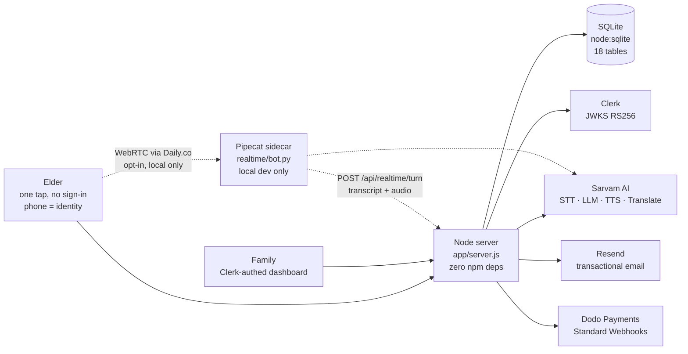

# Yaadein · यादें

**A voice companion for elders living with memory loss — in the language they actually speak at home.**

An elder taps one button and talks. Yaadein leads the conversation using Cognitive Stimulation Therapy themes, remembers what they said, and never tests them — forgetting is answered as a gift, not corrected. Their family gets a living memoir, per-session clinical notes, and a sixty-second briefing before each visit.

Built for the Sarvam Epoch Buildathon, July 2026. **Every model in it is Sarvam's.**

---

## Architecture

One Node process and a SQLite file in production. Add a Pipecat sidecar for real-time WebRTC voice in local development.



The Node server is the single source of truth for conversations, memory, and safety. The realtime sidecar owns audio transport only — it runs a Pipecat pipeline (Silero VAD → Sarvam STT → Sarvam TTS), then hands the finished transcript and audio back to the Node server via `POST /api/realtime/turn`. The Node server runs the LLM turn, memory extraction, voice guards, and database writes. One code path for storage, regardless of how audio arrives.

---

## The Sarvam surface

Every language-touching operation uses a Sarvam model. No non-Sarvam model does language work anywhere in the product.

| Endpoint | Model | What it does |
|---|---|---|
| `/speech-to-text` | `saaras:v3`, `mode: codemix` | Elders mix Hindi and English mid-sentence; codemix handles that natively. Supports 11 Indian languages. |
| `/v1/chat/completions` | `sarvam-30b`, `reasoning_effort: null` | Every ordinary voice turn — thinking disabled for latency (`temperature: 0.4`, `max_tokens: 160`) |
| `/v1/chat/completions` | `sarvam-105b` | The delicate turns — stalled recall cues, structured memory extraction, memoir synthesis, Session Scribe clinical reports, pre-visit briefings |
| `/text-to-speech` | `bulbul:v3`, voice `simran`, pace `0.85` | Slowed deliberately; default pace is too fast for elders to follow. 24kHz WAV, 11 languages. |
| `/translate` | — | So an English-reading child can read a Hindi conversation. Also translates openers into the elder's target language. |

`sarvam-30b` is a reasoning model. Setting `reasoning_effort: null` disables thinking for fast voice turns. `sarvam-105b` is used when depth matters more than speed — memory extraction, memoir, scribe reports, and when the elder's recall stalls and the cue must be safe (never leak the answer).

---

## External services

| Service | What for | Auth mechanism |
|---|---|---|
| **Sarvam AI** | STT, LLM, TTS, translation — one key covers all four | API key |
| **Clerk** | Family dashboard auth (Google OAuth) | RS256 JWT verified against JWKS by hand using `node:crypto` |
| **Dodo Payments** | Family subscriptions, founding-family seats | Standard Webhooks HMAC-SHA256 verified by hand using `node:crypto` |
| **Resend** | Transactional email — seat confirmations, app announcements | API key; gracefully degrades to console logging if unset |
| **Daily.co** | WebRTC rooms for the realtime sidecar | API key; only needed in local dev |
| **Railway** | Deployment platform | `PORT` and `NODE_ENV` set by Railway |

---

## Conversation pipeline

```
Elder taps orb
   │
   ▼
┌─────────────────────────────────────────────────────────────────┐
│  POST /api/turn  (or /api/session/start for the opening turn)  │
│                                                                 │
│  1. Sarvam STT (saaras:v3, codemix) → transcript               │
│  2. Voice guards (voice.js):                                    │
│     · strip fillers (um, uh, hmm, achha, haan haan…)           │
│     · detect repetition → redirect gently                      │
│     · detect dangling recall → offer safe cue                  │
│     · detect echo → vary the response                          │
│     · enforce BANNED recall-test phrases                        │
│  3. Build messages w/ system prompt:                            │
│     · CST theme for the session (kahavat, swad, sangeet…)      │
│     · orientation line (IST time, season, family context)      │
│     · undiscussed family photo, if any                         │
│     · family reminders woven in naturally                      │
│  4. Sarvam LLM (sarvam-30b or sarvam-105b if stalled/delicate)│
│  5. Parallel: structured memory extraction (sarvam-105b)       │
│     · provenance grading, contradiction detection              │
│     · supersession, variant versioning                         │
│  6. Store turn + memories in SQLite                             │
│  7. Sarvam TTS (bulbul:v3, simran, 0.85) → WAV audio          │
│  8. Return { text, audio, person, language, contract }         │
└─────────────────────────────────────────────────────────────────┘
```

The realtime sidecar runs STT and TTS in its Pipecat pipeline, but POSTs the transcript to `/api/realtime/turn` so memory extraction, voice guards, and storage go through the same path.

---

## Session Contract

Every session tracks six metrics that the system must satisfy before closing:

| Signal | Meaning |
|---|---|
| `RESUMED` | Picked up a thread from a previous conversation |
| `CAPTURED` | At least one new memory was extracted and stored |
| `CLOSED` | No open loops left dangling at session end |
| `WRITTEN` | Session notes were generated (sarvam-105b) |
| `SAFE` | No banned recall-test phrases were used |
| `ENGAGED` | Sufficient turn count, word count, and topic elaboration |

---

## Data model

18 SQLite tables via `node:sqlite`. Key entities:

```
people           phone (identity), name, language, family ownership
sessions         person → people, started_at
turns            session → sessions, question, answer, delay_ms
memories         person → people, statement, canonical, category,
                 emotional_tone, provenance, audio_file, status,
                 visit_count, safe_to_use
                 Provenance: USER_STATED | USER_CONFIRMED | USER_ELABORATED |
                             USER_CORRECTED | SESSION_OBSERVED | FAMILY_VERIFIED
                 Status: ACTIVE | SUPERSEDED | UNRESOLVED
variants         memory → memories, conflicting statements versioned
open_loops       person → people, topic, status (OPEN | CLOSED)
photos           person → people, file, event, place, year, people_json, deceased flag
reminders        person → people, text, time_of_day, mention_count, ack_count
registrations    phone (unique), elder_name, language, family_name, owner_id, plan
payments         phone, event_type, status, amount, currency, raw JSON
waitlist         owner_id, email, name, seat number, tier (founding | regular)
checkins         person → people, cadence, quiet hours, last_alert_at
checkin_events   person → people, kind (missed | resumed | dialled), hours_quiet
engagement       person → people, session, CST theme, items, enjoyed
scribe_sessions  person → people, facilitator, transcript_json, report_json
notify           email, topic, platform
feedback         message, sentiment, email, page, owner_id
webhook_events   idempotency guard for Dodo webhooks
```

---

## Repo map

```
app/                         Node.js backend — zero npm dependencies, ~110KB server.js
  server.js                    HTTP server, full API router, conversation pipeline,
                                Sarvam integration, memory extraction, session management,
                                phone verification, demo claiming, admin endpoints,
                                static SPA serving from landing-page/dist/
  db.js                        SQLite schema (18 tables), queries, memory deduplication,
                                contradiction detection, provenance tracking, access control
  prompts.js                   System prompt, CST themes (kahavat, shabd_bazaar, swad,
                                duniya, sangeet), orientation line, session/memoir/briefing
                                generation prompts
  voice.js                     Pure text guards — filler stripping (Hindi + 10 Indian
                                languages), repetition/echo/dangling-recall detection,
                                BANNED recall-test regex, floor-keeping logic
  clerk.js                     Zero-dep Clerk JWKS verification — fetches RSA keys,
                                caches 55min, verifies RS256 JWTs with node:crypto
  checkin.js                   "Has she gone quiet?" — sweeps on cadence, respects quiet
                                hours, writes missed/resumed/dialled events, pluggable dialer
  dodo.js                      Dodo Payments webhook — HMAC-SHA256 verification, plan mapping,
                                replay-attack tolerance, idempotency
  email.js                     Resend transactional emails — seat confirmed (founding vs
                                regular), app announcement, graceful fallback to console
  sim.js                       Scenario simulator — 9 test personas, reply linter (word
                                limit, script fit, hallucination, recall-test, repetition),
                                safety phone prefix (5XXXXXXXXX)
  public/                      Static fallback pages (family.html, memory.html, favicon)
  .env.example                 All environment variables, extensively documented

realtime/                    Pipecat WebRTC sidecar (Python ≥3.12, local dev only)
  bot.py                       aiohttp on :7860, Daily.co room creation, Pipecat pipeline:
                                Silero VAD (tuned for elders: 1s stop window) → Sarvam STT
                                → transcript POST to Node → Sarvam TTS. Tracks speech-latency
                                biomarker (delay_ms between bot stop and user start)
  pyproject.toml               pipecat-ai[runner,sarvam,silero,webrtc]==1.6.0, managed by uv

landing-page/                React 19 + TypeScript + Vite 8 + Tailwind CSS v4
  src/
    main.tsx                   Entry point, Clerk provider, OAuth route recovery
    App.tsx                    Hash router (#/try, #/family, #/waitlist, #/stats, #/home)
    data.ts                    Marketing copy and feature data
    index.css                  Design tokens, Tailwind imports
    lib/
      api.ts                   API base URL resolution
      auth.ts                  Clerk auth bridge, authFetch with token injection
      wav.ts                   Custom 16kHz mono PCM16 WAV encoder
    components/
      Auth.tsx                 AuthProvider, RequireFamilySignIn, route recovery
      Orb.tsx                  Canvas 3D glowing voice orb with status animations
      Phone3D.tsx              Three.js interactive smartphone render
      PhoneGate.tsx            Phone entry dialog, demo phone claiming
      Confetti.tsx             Waitlist celebration animation
      ...                      Logo, LangSelect, FeedbackButton, Primitives
    sections/                  Landing page: Hero, Personas, Loop, Experience,
                                Languages, Coverage, Pricing, About, Footer, Nav
    try/
      TryPage.tsx              Transport switcher (REST vs WebRTC, lazy-loaded)
      TryShell.tsx             Shared UI: orb, mic button, captions, contract badges
      TryPageRest.tsx          Record-then-upload via Web Audio API, client-side VAD
      TryPageRealtime.tsx      Continuous WebRTC via @pipecat-ai/client-js
      errors.ts                Compassionate, non-jargon error messages for elders
      types.ts                 Shared voice/photo types
    family/
      FamilyPage.tsx           Dashboard shell, household/person picker
      OverviewPanel.tsx        At-a-glance health metrics and open loops
      types.ts                 TypeScript interfaces for API models
      cards/
        CheckinCard.tsx        Inactivity schedule config, call history
        HandoffCard.tsx        One-tap WhatsApp setup link for elders
        RemindersCard.tsx      Gentle conversational reminder management
        SetUpPanel.tsx         Parent phone onboarding form
      tabs/
        BriefingTab.tsx        60-second pre-visit briefing with warnings
        SignalsTab.tsx         Question-delay alerts (≥4s/7s), fading memories,
                                CST engagement stats, word fluency trend chart
        ScribeTab.tsx          Real-time clinical session recorder (20s WAV chunks),
                                generates doctor-ready reports with Print button
        MemoirTab.tsx          AI-generated living memoir, audio source links,
                                English translation toggle, TTS narration
        MemoriesTab.tsx        Provenance memory bank, conflict resolver,
                                safe_to_use policy toggle
        PhotosTab.tsx          Family photo upload with conversational metadata,
                                deceased status gate
    waitlist/
      WaitlistPage.tsx         50-seat waitlist, founding-family tier, confetti
    stats/
      StatsPage.tsx            Live usage stats, 30s polling

scripts/                     Tests and utilities (node:test, no framework, no network)
  voice-guards.mjs             Filler stripping, dangling recall, paragraph dedupe
  checkin-tests.mjs            Cadence clamping (4h–168h), quiet hours, dedupe, resume,
                                dialer adapter, midnight-wrapping quiet windows
  auth-tests.mjs               Launches fake Clerk JWKS server, tests household ownership,
                                cross-family isolation, elder no-auth access, demo safety
  email-tests.mjs              Template rendering, founding-family wording, XSS escaping,
                                graceful degradation, waitlist/notify DB ops
  elder-error-tests.mjs        Compiles errors.ts via tsc, verifies every error message
                                is compassionate, actionable, and names an action
  sim-tests.mjs                Voice guards + linter: hallucination detection, script fit
                                (11 Indic scripts), word limits, repetition, recall-test ban
  attack.mjs                   17 adversarial integration tests: memory supersession,
                                variance handling, identity isolation, prohibited recall,
                                dangling stubs, repetition, cue safety
  webhook-test.mjs             Dodo payment webhook harness: signs, sends, verifies
                                idempotency, forged-signature rejection
  sim.mjs                      CLI scenario runner: lists/runs scenarios, --full, --tts, --say
  email-preview.mjs            Renders all email templates to .preview-email/

docs/                        Product and technical documentation (11 files)
  README.md                    Sitemap, architecture overview, env keys, run/deploy commands
  01-product-brief.md          3 outputs, 5 principles, Session Contract, 6-min demo spine
  02-user-stories.md           37 stories across 6 epics (Voice, Memory, Safety, Family,
                                Coverage, Guardian Cues)
  03-tech-plan.md              8-phase build plan, schema, WebSocket loop, cut order
  04-positioning.md            Competitive analysis vs LifeBio, KindredMind, Sunny, etc.
  05-epoch-sprint-plan.md      Frozen API contracts, CST engine, sprint priorities
  06-market-research.md        Caregiver pain, B2B partners, evidence (I-CONECT, Cochrane)
  07-keys-and-accounts.md      Dodo KYC, Clerk setup, ops runbook
  08-submission.md             Hackathon submission pack, Sarvam model breakdown, demo script
  09-tam-pmf.md                TAM $6.97B, SAM 796K households, 3-year SOM, PMF evidence
  DECISIONS.md                 19 autonomous architectural decisions (D1–D19)
```

---

## Running it

```bash
# 1. Set up environment
cp app/.env.example app/.env        # at minimum, add SARVAM_API_KEY

# 2. Start the backend (serves the built SPA on :3000)
npm start                           # or hack with: node --watch --experimental-sqlite app/server.js

# 3. Optional: build the frontend fresh
npm run build                       # cd landing-page && npm ci && npm run build

# 4. Optional: run the frontend in dev mode on :5173 (proxies /api → :3000)
cd landing-page && npm install && npm run dev
```

Then open `http://localhost:3000/#/try` (or `:5173` in dev mode).

**Realtime voice** is opt-in and local-only:

```bash
# 1. Start the Pipecat sidecar (needs uv and Python ≥3.12)
npm run realtime                    # uv run python bot.py on :7860

# 2. Tell the frontend
echo 'VITE_REALTIME_URL=http://localhost:7860' > landing-page/.env.local
```

Leaving `VITE_REALTIME_URL` unset (which is what any deploy does) keeps the record-then-upload flow that needs nothing but the Node server. Railway does not accept inbound UDP, so WebRTC cannot reach a container there without a relay.

**Requirements:** Node ≥ 22 (for `node:sqlite` and `node:test`). Python ≥ 3.12 + `uv` for the realtime sidecar.

---

## Tests

```bash
npm test
```

Six test suites, no framework, no network:

| Suite | What it covers |
|---|---|
| `voice-guards.mjs` | Filler stripping across Hindi + 10 Indian languages, dangling recall, paragraph dedupe |
| `checkin-tests.mjs` | Cadence clamping (4h–168h), quiet-hours midnight wrapping, dedupe, resume, dialer failures |
| `auth-tests.mjs` | Spins up a fake Clerk JWKS issuer, tests household ownership, cross-family isolation, elder no-auth, demo safety |
| `email-tests.mjs` | Template rendering, founding-family wording, XSS escaping, graceful degradation without API key |
| `elder-error-tests.mjs` | Compiles `errors.ts` via tsc, verifies every message is compassionate and names an action |
| `sim-tests.mjs` | Linter + voice guards: hallucination detection, script fit (11 Indic scripts), word limits, recall-test ban |

```bash
node scripts/attack.mjs              # 17 adversarial integration tests (needs running server)
node scripts/email-preview.mjs       # renders all email templates to .preview-email/
npm run sim                          # CLI scenario runner for conversation policy auditing
```

---

## Notable constraints

- **Zero npm dependencies in the backend.** SQLite through `node:sqlite`, RS256 JWT verification against Clerk's JWKS by hand, Standard Webhooks HMAC by hand — all using `node:crypto`. The frontend has runtime dependencies: React, Clerk, Pipecat client, Three.js, and a QR code library.
- **The elder never authenticates.** Their phone number *is* the account; a family sends a one-tap WhatsApp link. Asking someone with memory loss to sign in would contradict the whole product.
- **Nothing is invented.** The agent may only speak facts someone actually supplied. Every memory carries its provenance (`USER_STATED` through `FAMILY_VERIFIED`) and original audio.
- **One code path for storage.** Whether audio arrives via record-then-upload or the WebRTC sidecar, it enters the same conversation pipeline and hits the same database writes.
- **Every reply is guarded.** `voice.js` enforces a `BANNED` regex against recall-test phrases, strips fillers in 11 languages, detects repetition and echo, and keeps the conversational floor. `sim.js` lints every reply for word limits, script fit, hallucinated details, and policy violations.
- **Safety phone prefixes.** Demo phones use `4XXXXXXXXX`, simulation phones use `5XXXXXXXXX` — zero chance of polluting real family data.
- **Deploys on Railway.** `.railwayignore` excludes the realtime sidecar, source files, docs, and scripts — only the Node server and the built SPA ship.

---

## Documentation

| Doc | Contents |
|---|---|
| [docs/README.md](docs/README.md) | Architecture overview, env keys, run/deploy |
| [docs/01-product-brief.md](docs/01-product-brief.md) | Session Contract, 5 principles, demo spine |
| [docs/02-user-stories.md](docs/02-user-stories.md) | 37 user stories across 6 epics |
| [docs/03-tech-plan.md](docs/03-tech-plan.md) | 8-phase build plan |
| [docs/04-positioning.md](docs/04-positioning.md) | Competitive analysis |
| [docs/06-market-research.md](docs/06-market-research.md) | Caregiver pain, evidence base |
| [docs/08-submission.md](docs/08-submission.md) | Hackathon submission pack |
| [docs/09-tam-pmf.md](docs/09-tam-pmf.md) | TAM/SAM/SOM, PMF evidence |
| [docs/DECISIONS.md](docs/DECISIONS.md) | 19 autonomous architectural decisions |
