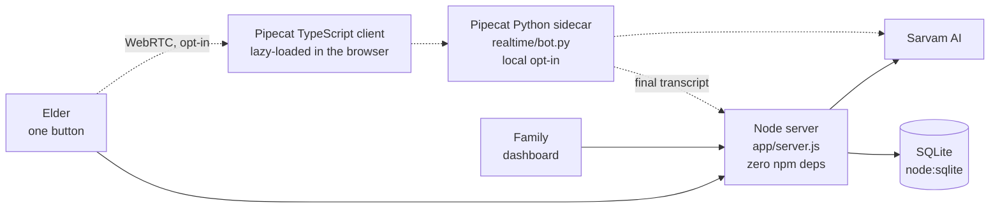

# Yaadein · यादें

**A voice companion for elders living with memory loss — in the language they actually speak at home.**

An elder taps one button and talks. Yaadein leads the conversation, remembers what they said, and never tests them: forgetting is answered as a gift, not corrected. Their family gets a living memoir and a sixty-second briefing before they visit.

Built for the Sarvam Epoch Buildathon, July 2026. **Every model in it is Sarvam's.**

---

## Architecture

Two processes in production, three in local development.



The Node server is the single source of truth for conversation, memory and safety. The realtime sidecar owns audio transport only — it streams speech, then hands the finished transcript to the same pipeline the REST path uses, so there is one implementation of the thinking.

### The Sarvam surface

| Endpoint | Model | Where |
|---|---|---|
| `/speech-to-text` | `saaras:v3`, `mode: codemix` | elders mix Hindi and English mid-sentence |
| `/v1/chat/completions` | `sarvam-30b` | every ordinary turn, thinking disabled for latency |
| `/v1/chat/completions` | `sarvam-105b` | the delicate turns — stalled recall, the memoir, session notes |
| `/text-to-speech` | `bulbul:v3`, voice `simran`, pace `0.85` | slowed deliberately: default pace is too fast to follow |
| `/translate` | — | so an English-reading child can read a Hindi conversation |

No non-Sarvam model does language work anywhere in the product.

---

## Repo map

```
app/          the whole backend, zero npm dependencies
  server.js     HTTP router, conversation loop, Sarvam calls
  db.js         SQLite schema + queries (node:sqlite)
  checkin.js    "has she gone quiet?" — alerts the family on silence
  dodo.js       payment webhooks, hand-rolled Standard Webhooks HMAC
  email.js      Resend receipts (seat confirmed, app announcement)
  prompts.js    the product's voice: system prompt, CST themes, orientation
  voice.js      pure text guards — repetition, dangling recall, fillers
realtime/     Pipecat server pipeline (Python, optional, local only)
landing-page/ React + Vite site, including the Pipecat TypeScript client
  src/try/        the elder's screen — one orb, nothing else
  src/family/     the caregiver dashboard, one module per panel
  src/waitlist/   the first-fifty cohort
scripts/      tests (plain node, no framework)
docs/         product brief, tech plan, decisions log → docs/README.md
```

---

## Running it

```bash
# 1. keys
cp app/.env.example app/.env        # add SARVAM_API_KEY

# 2. backend + built site on :3000
npm start

# 3. the site in dev mode on :5173 (optional)
cd landing-page && npm install && npm run dev
```

Then open `http://localhost:3000/#/try`.

**Realtime voice** is opt-in and local-only. Start the sidecar with `npm run realtime`, then set `VITE_REALTIME_URL=http://localhost:7860` in `landing-page/.env.local`. Leaving it unset — which is what any deploy does — keeps the record-then-upload loop that needs nothing but the Node server. The browser integration is already TypeScript; Pipecat's supported server runtime remains Python. See [the realtime deployment guide](docs/10-realtime-deployment.md) before enabling it in production.

## Tests

```bash
npm test     # 98 tests, no framework, no network
```

Covering the voice guards (filler stripping, echo and repetition), the check-in engine (cadence clamping, quiet hours, dedupe, resume), the auth boundary (that the elder can talk with no sign-in, and that one family cannot read another's memories), and the emails — including that a Founding Family is never quoted a date they start paying.

```bash
node scripts/email-preview.mjs   # renders every email to .preview-email/
```

## Notable constraints

- **Zero npm dependencies in the backend.** SQLite through `node:sqlite`, RS256 JWT verification against Clerk's JWKS by hand, HMAC by hand.
- **The elder never authenticates.** Their phone number *is* the account; a family sends a one-tap setup link. Asking someone with memory loss to sign in would contradict the whole product.
- **Nothing is invented.** The agent may only speak facts someone actually supplied, and every memory carries its provenance and original audio.

Full documentation: [docs/README.md](docs/README.md) · autonomous calls taken during the build: [docs/DECISIONS.md](docs/DECISIONS.md)
