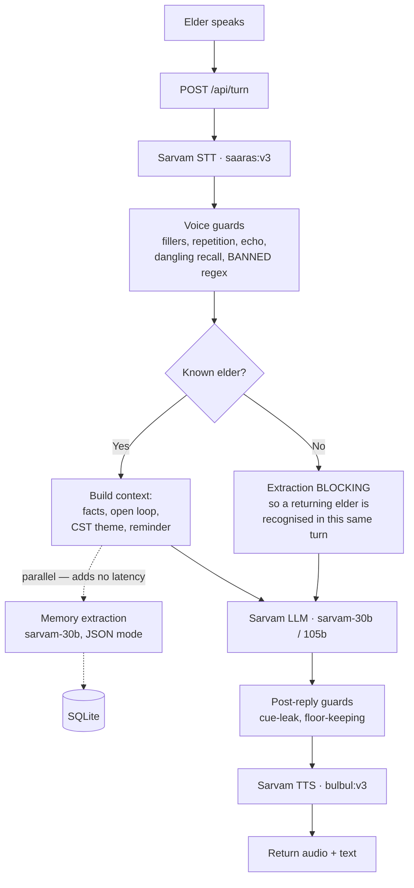
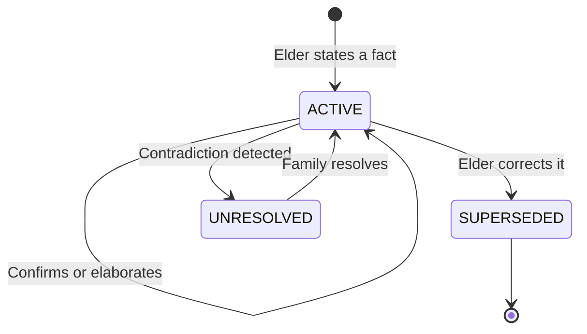
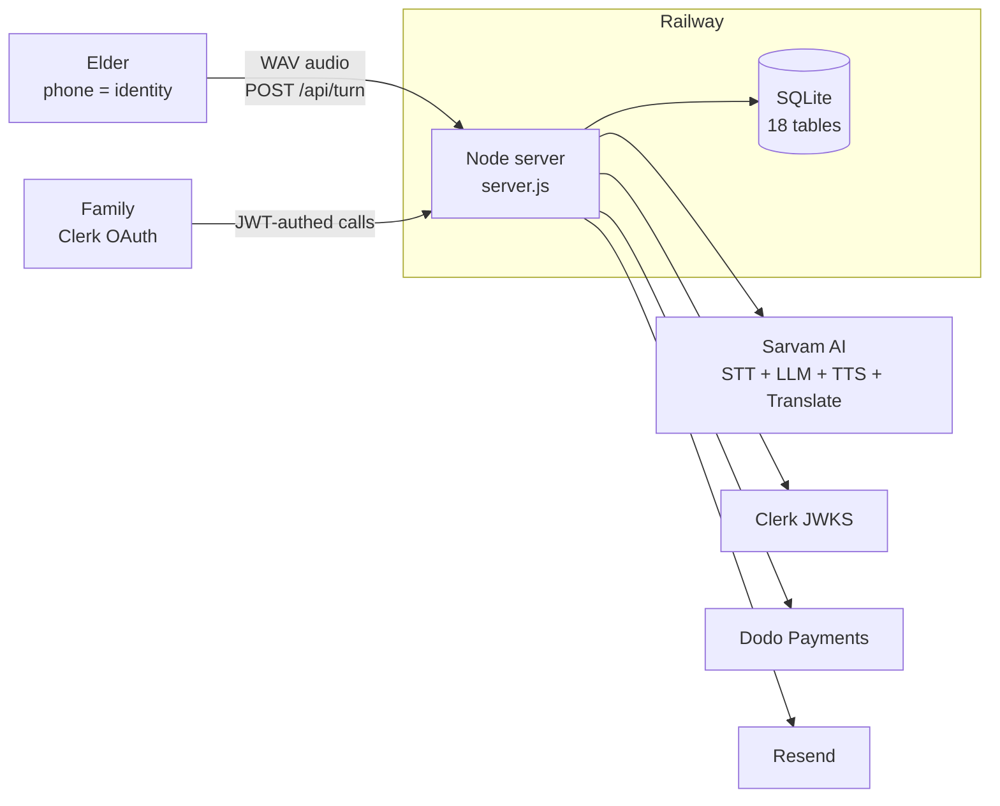

# Yaadein — यादें

**A voice companion for elders living with memory loss, in the language they speak at home.**

The elder taps one button and talks. Yaadein leads the conversation using Cognitive Stimulation Therapy themes, remembers what they said, and never tests their memory. Forgetting is met with warmth, not correction. The family gets a living memoir, clinical session notes, and a sixty-second briefing before each visit.

Built for the Sarvam Epoch Buildathon, July 2026. **Every model in the product is Sarvam's.**

| | |
|---|---|
| **Live** | **https://www.yaadeinapp.com** |
| Talk to it (the elder's screen) | [`#/try`](https://www.yaadeinapp.com/#/try) |
| Family dashboard | [`#/family`](https://www.yaadeinapp.com/#/family) |
| Live usage counters | [`#/stats`](https://www.yaadeinapp.com/#/stats) |
| The first fifty seats | [`#/waitlist`](https://www.yaadeinapp.com/#/waitlist) |
| Demo number for reviewers | `1234567890` — or register any 10-digit number |

---

# For reviewers — start here

The five judging criteria, in your order, each with the section that answers it and the single fastest thing to look at.

| # | Criterion | Answered in | Fastest proof |
|---|---|---|---|
| 1 | **Impact of Sarvam's models** | [§1](#1--impact-of-sarvams-models) | The [turn pipeline diagram](#every-sarvam-call-is-on-the-critical-path) — four Sarvam calls sit on the critical path of a single conversational turn. Remove any one and there is no product. |
| 2 | **Live, production-ready** | [§2](#2--live-and-production-ready) | Open the site and talk to it. Zero npm dependencies in the backend. 223 tests, green. |
| 3 | **Real traction** | [§3](#3--real-traction) | [`#/stats`](https://www.yaadeinapp.com/#/stats) — unseeded public counters, straight from the production database. |
| 4 | **Business impact** | [§4](#4--business-impact) | ₹1,499/month against a ₹40,000/month attendant who doesn't speak the elder's language. |
| 5 | **Technical depth** | [§5](#5--technical-depth) | [Five things that are ours](#five-things-that-are-ours), starting with provenance-graded memory and contradiction quarantine. |

**Also worth your time:** [what 1,000 customers would actually require](#what-1000-customers-would-actually-require) — benchmarked, not guessed. And [architecture](#architecture), [repo map](#repo-map), [running it locally](#running-it-locally), [tests](#tests).

## Verify it yourself in 60 seconds

Nothing here needs a key, an account, or our word for it.

1. Open [`#/try`](https://www.yaadeinapp.com/#/try), enter `1234567890`, and **talk to it in Hindi.** No signup, no install — that is the elder's entire experience.
2. Reload and talk again. It greets you by name and reopens the story you left unfinished.
3. Open [`#/stats`](https://www.yaadeinapp.com/#/stats) for live usage counters, read straight off the production database and polled every 30 seconds. Nothing there is fixtured or seeded.
4. Open [`#/family`](https://www.yaadeinapp.com/#/family) and note that it asks you to sign in. The family's data needs an account; the elder's conversation never does.

---

# 1 · Impact of Sarvam's models

**Sarvam is not a feature here. It is the reason the product can exist.** No other AI vendor appears anywhere in the stack — no OpenAI, no Anthropic, no Google, no vector database, no embedding model.

The core problem is that the therapy which works for dementia is not a drug, it is *conversation* — and it has to happen in the elder's own language, every day, forever. India has fewer than 50 specialised dementia centres for 8.8 million people and is short 4.3 million professional caregivers. A companion that speaks only English or only Hindi solves nothing. Sarvam is what makes an eleven-language, code-mixing, elder-paced conversation possible at all.

| Sarvam capability | Endpoint & config | What it does in Yaadein | Why the product dies without it |
|---|---|---|---|
| **Saaras v3** | `/speech-to-text`, `mode: codemix` | Every elder utterance, and every 20-second chunk of a recorded human therapy session | Elders speak Hindi/Kannada/Marathi with code-mixed English, slowly, in noisy rooms. Generic STT fails this speaker profile. |
| **Sarvam-30B** | `/v1/chat/completions`, `reasoning_effort: null`, `temp 0.4`, `max_tokens 160` | Leads the conversation, runs the CST activity, and extracts structured memories in parallel | The therapy *is* the conversation. Thinking disabled deliberately — it keeps a voice turn at roughly 0.4s. |
| **Sarvam-105B** | same endpoint, `temp 0.2–0.4`, `max_tokens 600–1600` | Two delicate jobs only: the stalled-recall cue, and the clinical session note | 30B either quizzed the elder or blurted the answer outright. 105B holds the constraint. A verified difference, not a preference. |
| **Bulbul v3** | `/text-to-speech`, voice `simran`, pace `0.85`, 24 kHz | Yaadein's voice, in 11 languages | Slowed from default on purpose — normal pace is too fast for an elder to follow. This voice *is* the product's entire surface. |
| **Sarvam Translate** | `/translate` | Opens the session in the elder's language; renders the memoir in English for the family | Sarvam-30B would not reliably open in Marathi from an empty history. Translate made it deterministic. |

### Every Sarvam call is on the critical path



Two details in that diagram matter. Memory extraction runs **in parallel** with the reply for a known elder so it costs no latency, but runs **blocking** for an unknown one so a returning person is recognised within the same turn. And the guards around the model are enforced in code, not in the system prompt — see [§5](#5--technical-depth).

**Deliberately not used: no vector database, no embeddings, no RAG.** At ~300 memories per elder, full-context beats top-k retrieval, and our hard problems — contradiction detection, provenance, recall trajectories over weeks — are ones embeddings are actively bad at. Reasoning in [`docs/DECISIONS.md`](docs/DECISIONS.md).

**One door to Sarvam.** All model calls go through a single module with one timeout and retry policy, rather than the eight duplicated `fetch` sites it replaced. A policy with eight homes has no home.

---

# 2 · Live and production-ready

Hosted, stable, self-serve. Anyone can use it right now with no invitation.

- **One Node process and one SQLite file.** That is the entire production stack — it serves the API *and* the built SPA from the same origin.
- **Persistent volume** mounted at the data directory, so memories survive every deploy and restart. Verified: a persona created before a redeploy was still there afterwards.
- **Self-serve.** Anyone registers a 10-digit number and starts talking. The family signs in with Google (Clerk) to see the dashboard; **the elder never signs in at all** — asking someone with memory loss to authenticate would contradict the product.
- **Zero npm dependencies in the backend.** Node built-ins only, including hand-rolled RS256 JWT verification against Clerk's JWKS and hand-rolled HMAC-SHA256 webhook verification for Dodo. Nothing to patch, nothing to break, no supply chain.
- **223 automated tests across 7 suites, green** — `npm test`, no framework and no network. Plus a 17-test adversarial integration suite (`scripts/attack.mjs`) that runs against a live server.
- **Graceful failure everywhere.** Upstream rate limits surface as an honest sentence an elder can act on, never a stack trace. Session GC, signup rate limiting, machine-readable error codes.

### Every external service degrades rather than breaks

| Service | What it does | How it authenticates | If the key is missing |
|---|---|---|---|
| **Sarvam AI** | STT, LLM, TTS, Translate — one key | `api-subscription-key` header | **No** — the product *is* Sarvam |
| Clerk | Family dashboard Google OAuth | RS256 JWT verified against JWKS by hand with `node:crypto`, cached 55 min | Yes — unset means no auth wall; elder routes never needed it |
| Dodo Payments | Family subscriptions, founding seats | Standard Webhooks HMAC-SHA256, verified by hand, 5-min replay window | Yes — webhook returns 503, checkout links simply disappear |
| Resend | Seat confirmations, app announcements | API key over `fetch` | Yes — emails log to console instead |

### Access model

Two identities, on purpose. **Clerk says *who* the family member is; the phone number says *which* elder.** They are separate because the elder must never authenticate.

Privilege is split too, and this is worth reading if you audit auth: `ALLOWED_PHONES` answers *may this number hold a conversation* — the public demo number `1234567890` belongs there. `ADMIN_PHONES` answers *may this number read everything we hold about other people* — and nothing public may ever answer yes to that. They used to be one list, which meant the number printed on our own website could read every waitlist email. Found, fixed, and now pinned by five regression assertions in `scripts/auth-tests.mjs`.

Reserved prefixes keep test traffic away from real families: demo households use `4XXXXXXXXX`, simulated personas use `5XXXXXXXXX`. No Indian mobile number starts with 4 or 5, so neither can ever collide with a real household.

---

# 3 · Real traction

**Live, public, unseeded counters: [`#/stats`](https://www.yaadeinapp.com/#/stats).** Read straight off the production database, polled every 30 seconds. Nothing is fixtured or seeded.

### Read the clock, not just the count

**The waitlist went live at 15:15 IST today.** Every number below arrived in the seven hours after that — the product had no way to sign anyone up before it existed. The most recent seat was claimed at **22:13**, six minutes before this snapshot was taken.

So this is not a total. It is a **rate**: roughly one family every half hour, still arriving, with no paid acquisition and no press — only messages sent by hand into caregiver communities.

Snapshot at **28 Jul 2026, 22:20 IST** — seven hours after launch. The live page will read higher.

| | |
|---|---|
| Families | 11 |
| Elders | 9 |
| Voice sessions | 61 |
| **Minutes of real conversation** | **140** |
| Memories kept | 175 |
| CST activity rounds | 49 |
| Photos uploaded | 4 |
| Languages spoken so far | Hindi, Tamil, **Kannada** |
| Seats claimed of 50 | 14 — all 10 free-forever seats gone within hours |

The number that matters most is **minutes of real conversation**, because it is the only one a signup button cannot fake. Every seat cost somebody a Google sign-in, and every one of those 140 minutes was somebody's parent choosing to keep talking.

Two details in that table are worth more than their size. **Kannada appeared on its own** — nobody on the team seeded a Kannada elder; a family picked it, which is the eleven-language claim being used rather than demonstrated. And **175 memories across 61 sessions** means people are coming back: a single visit does not accumulate a memory graph.

**Channels used:** caregiver communities (Caregiver Saathi, Dementia Care Notes, ARDSI and Dementia India Alliance support groups) for families; direct outreach to dementia day-care centres for pilots — Nightingales Medical Trust Bangalore (3 day-cares), Dementia India Alliance, Samvedna Care. Ranked list with numbers in [`docs/06-market-research.md`](docs/06-market-research.md) §3; outreach copy and the pilot LOI in [`docs/05-epoch-sprint-plan.md`](docs/05-epoch-sprint-plan.md) §6 and §8.

---

# 4 · Business impact

### The market's own numbers

Dementia costs an Indian household about **$571 a year — roughly 20% of what the government spends on health per capita** (AEA/LASI 2024). Urban families spend **₹45,600–₹2,02,450 a year**, and informal family care is about half of that cost. A trained dementia attendant starts at **₹40,000/month**; Bangalore memory day-care runs **₹25,000–₹85,000/month**.

Yaadein at **₹1,499/month is 2–3% of the cheapest alternative** — and it is the only one that shows up every single day.

### Pricing, live on the site

| Tier | Price | What it is |
|---|---|---|
| **Founding Family** | Free forever | The first ten seats. Claimed on day one. |
| **Family** | **₹0 for 3 months**, then ₹1,499/mo | Daily companion, family dashboard, memory book, weekly digest, recall trends a doctor can read. No card to start, and we ask before charging. |
| **Care Centres** | ₹600/seat/mo | Session Scribe, member dashboards, white-label family reports |

### Why the B2B line is the real business

Every global analogue that survived (LifeBio, MyndYou) went through institutions, not consumers. A centre charging ₹30–60k/month absorbs ₹600/seat without a thought — **1–2% of what a seat already costs them.** And what they actually buy is not the companion; it is documentation their single psychologist currently writes out by hand after every group session. That is what Session Scribe replaces.

### Who pays, and the cultural wedge

The adult child, often in another city, already spending this money and carrying the guilt. Indian caregivers crave respite but refuse outside help — *log kya kahenge*. A voice companion is not an outsider in the home and is not abandonment. It is **care that stays in the family.**

### The positioning that makes the market

**90% of Indian dementia is undiagnosed** and half of families call it normal ageing. So the consumer face is never "dementia" — it is *a memory companion for ageing parents*. The passive recall tracking is what eventually surfaces the diagnosis conversation. The product creates its own diagnosed market.

More: [`docs/04-positioning.md`](docs/04-positioning.md) (vs LifeBio, KindredMind, Sunny, Silver Saathi) · [`docs/09-tam-pmf.md`](docs/09-tam-pmf.md) (TAM $6.97B, SAM 796K households) · [`docs/06-market-research.md`](docs/06-market-research.md) (evidence base, ~70 sources).

---

# 5 · Technical depth

## Five things that are ours

**1 · Provenance-graded memory graph.** Every fact carries *how it was given* and its history across visits:

| Grade | Meaning |
|---|---|
| `USER_STATED` | They volunteered it |
| `USER_CONFIRMED` | The agent proposed it from context and they agreed |
| `USER_ELABORATED` | They added detail beyond what was proposed |
| `USER_CORRECTED` | They corrected a prior fact |
| `SESSION_OBSERVED` | Captured during a human-facilitated Session Scribe recording |
| `FAMILY_VERIFIED` | A family member resolved an `UNRESOLVED` conflict on the dashboard |

A memory sliding from `ELABORATED` down to bare `CONFIRMED` over several weeks is a clinical signal — and it is observed **passively**, never elicited by a test.

**2 · Contradiction quarantine with family arbitration.** "Two children" last week, "three" today. Both versions are kept, the fact goes `UNRESOLVED` and out of the agent's reach entirely, and the **family** — never the elder — settles it. The elder is not corrected, because being corrected is the experience we exist to remove.



The family can also set `safe_to_use = false` on any `ACTIVE` memory, which filters it out of conversation context at retrieval time — a flag on the row, not a status. The only statuses in the database are `ACTIVE`, `SUPERSEDED` and `UNRESOLVED`.

**3 · Speech-latency biomarkers.** The browser measures the gap between the end of Yaadein's question and the elder's first voiced frame. ≥4s is flagged, ≥7s escalates. Grounded in published work: silent-pause analysis of connected speech tracks cognitive decline, and dementia is detectable from voice-assistant interaction patterns.

**4 · The game is also the instrument.** The naming activity — *"chalo, sabzi mandi chalte hain"* — silently counts what she lists. **Semantic verbal fluency is one of the oldest validated dementia screens**, so every round administers a real measure while she plays a game. She is never told a number, and never told she is being measured.

**5 · Safety enforced in code, not in prompts.** Prompt rules leaked every single time we relied on them, so the guards are executable and unit-tested in `voice.js`:

- a `BANNED` regex for recall-test phrasing (`yaad hai?`, `yaad karo`) with surgical rewrite
- a **repetition guard** — the model re-asked one question four turns running before it existed
- a dangling `"aapne bataya tha…"` stripper
- a **cue-leak guard** that regenerates any hint which restates the very fact the elder was reaching for, and drops the offending sentences if regeneration still leaks
- `keepTheFloor()` — if a reply contains no question, one is appended, so the conversation can never die on the elder

## The Session Contract

Every session tracks six signals. The elder's screen shows them live, and every test report asserts on them.

| Signal | What trips it |
|---|---|
| `RESUMED` | Context loaded from a previous session for this elder |
| `CAPTURED` | At least one new fact extracted and stored |
| `CLOSED` | A prior open loop resolved or explicitly re-queued |
| `WRITTEN` | Briefing/memoir inputs updated |
| `SAFE` | **False** if a `BANNED` phrase survived every guard |
| `ENGAGED` | Turn count, elder word count, elaborated facts |

## Architecture



---


# What 1,000 customers would actually require

We measured this rather than guessed it. The benchmark seeds a database with the app's own schema at the maturity the product describes — **1,000 elders, 300 memories each, 100 sessions each, 10 turns per session: 300k memories and 1M turns** — and times the queries the running server actually issues.

### Measured, at 1,000 customers

| Query | When it runs | Time |
|---|---|---|
| `memoriesFor(person)` — builds the conversation context | **every turn** | 7.6 ms |
| `openLoopFor(person)` | every turn | 0.1 ms |
| recent sessions for the theme picker | every turn | 5.0 ms |
| dedup probe before storing a memory | every turn | 7.1 ms |
| recent turns for the delay signals | every turn | 10.1 ms |
| **total blocking DB work per turn** | | **≈ 30 ms** |
| `stats()` full aggregate | once a minute (cached 60s) | 174 ms |
| one family opening their whole dashboard | per page load | 7.6 ms |
| check-in sweep across *all* elders | every 10 minutes | 0.5 ms |

Database size at that scale: **89 MB.**

### What that means for the current stack

`node:sqlite` is synchronous, so those 30 ms per turn are 30 ms of blocked event loop — the honest way to read the number. At 1,000 customers having one conversation a day, that is 10,000 turns a day; even if half of them land in a three-hour evening peak, it works out to roughly **0.5 turns per second, or about 1.5% of one CPU core** spent in the database. The remaining seconds of each turn are Sarvam network calls, which don't block anything.

**So the answer is yes: one Node process and one SQLite file carry 1,000 customers without changing shape.** It would take roughly a 20× traffic spike before the event loop was even a quarter busy.

### What we would change, in the order it starts to matter

1. **Move turn audio to object storage.** This is the real constraint, and it is not the database. Every stored turn recording measures **129 KB** (measured, not estimated), so 1M turns is tens of gigabytes on a Railway volume — while the database itself is 89 MB. S3 or R2 behind the existing `/api/audio/:file` route, which is already the only way audio is read.
2. **Add the indexes.** There is exactly **one index** across 18 tables today, and the numbers above are what unindexed scans cost at this size — fast enough to ignore at 1,000, linear in rows, so `memoriesFor` grows to ~76 ms at 10,000 customers. `memories(person_id, status)` and `turns(person_id, id)` are two lines that make it constant instead.
3. **Make `stats()` incremental.** 174 ms is the single slowest thing in the system, because it counts 1M rows from scratch. It is cached for 60 s so it costs 0.3% of a core — but when it does run it stalls the loop, so one unlucky elder waits an extra 174 ms mid-conversation. A counters row updated on write removes it entirely.
4. **Switch SQLite to WAL.** Currently `journal_mode = delete`. Single-process synchronous access means there is no contention to fix today, so this is about crash durability, and it is one pragma.
5. **Then, and only then, split the process.** SQLite on a mounted volume means one writer, so there is no horizontal scaling and no zero-downtime deploy — a restart is ~30 s. Beyond roughly 10,000 customers that becomes the reason to move to Postgres and run replicas. Not before: a single box with a local file is faster than a network database at this scale, and it is the reason a voice turn is as quick as it is.

**The ceiling we would hit first is not ours.** A turn makes four Sarvam calls — STT, reply, memory extraction, TTS. At 1,000 customers that is roughly 2 calls per second sustained, so the binding constraint becomes our Sarvam quota, not our architecture.

---

# Running it locally

```bash
# 1. environment
cp app/.env.example app/.env        # add SARVAM_API_KEY at minimum

# 2. backend on :3000 (also serves the built SPA)
npm start

# 3. frontend dev server on :5173 (optional)
cd landing-page && npm install && npm run dev
```

Open `http://localhost:3000/#/try`. The public demo number is `1234567890`.

Requires **Node ≥ 22** for `node:sqlite` and `node:test`. Every environment variable is documented in [`app/.env.example`](app/.env.example); the product runs with only `SARVAM_API_KEY` set.

# Tests

```bash
npm test        # 223 tests, 7 suites, no framework, no network
```

| Suite | What it covers |
|---|---|
| `voice-guards` | Filler stripping across 11 languages, dangling recall removal, paragraph dedupe |
| `sarvam-tests` | The single Sarvam door: 429/503 retried *exactly once*, a persistent 429 gives up rather than hammering, a hang raises `SarvamTimeout` and is **not** retried (so one hang costs one budget, not two), a 400 is treated as our bug and not retried, and STT/TTS unwrapping — including silence returning an empty transcript rather than `undefined` |
| `checkin-tests` | Cadence clamping (4h–168h), quiet-hours midnight wrapping, dedup, resume, dialer failure |
| `auth-tests` | Fake Clerk JWKS issuer, household ownership, cross-family isolation, elder no-auth, ownerless-household seizure, admin/demo privilege split |
| `email-tests` | Template rendering, founding-family wording, XSS escaping, graceful degradation with no API key |
| `elder-error-tests` | Compiles `errors.ts` and asserts every message is compassionate and names an action |
| `sim-tests` | Reply linter: hallucination detection, script fit across 11 Indic scripts, word limits, recall-test ban |

```bash
node scripts/attack.mjs         # 17 adversarial integration tests (needs a running server)
npm run sim                     # scenario runner: 9 personas, conversation policy audit
node scripts/webhook-test.mjs   # Dodo signing, idempotency, forged-signature rejection
node scripts/email-preview.mjs  # renders every template to .preview-email/
```

`scripts/sim.mjs` is worth a look on its own: nine scripted elder personas run against the real pipeline, with a linter that fails a reply for hallucinating a detail, drifting out of script, exceeding the word limit, or testing the elder's recall. It found seven real bugs.

---

# Repo map

```
app/                         Node.js backend, zero npm dependencies
  server.js                    2143 lines. HTTP server, full API surface, conversation
                               pipeline, memory extraction, session management, and
                               static SPA serving from landing-page/dist/
  sarvam.js                    The one door to Sarvam. Every model call in the product
                               goes through it — one timeout policy, one retry policy
  db.js                        SQLite via node:sqlite. 18 tables. Memory deduplication,
                               contradiction detection, provenance tracking, variant
                               versioning, access control (ownsPhone/ownsPerson)
  prompts.js                   System prompt, 5 CST themes (kahavat, shabd_bazaar, swad,
                               duniya, sangeet), orientation line (IST time + season),
                               opener/memoir/briefing/scribe prompts
  voice.js                     Code-enforced guards: filler stripping (11 languages),
                               repetition, echo, dangling recall, BANNED recall-test
                               regex, floor-keeping. No AI calls in this file.
  clerk.js                     Zero-dep Clerk JWKS: fetch RSA keys, JWK → KeyObject,
                               cache 55 min, verify RS256
  checkin.js                   Silence monitoring: cadence sweeps (4h–168h), quiet hours
                               with midnight wrapping, missed/resumed events
  dodo.js                      Payment webhooks: HMAC-SHA256, plan mapping, replay
                               tolerance, constant-time comparison
  email.js                     Resend: seat confirmed (founding vs regular), app
                               announcement. Falls back to console.log with no key
  sim.js                       Scenario simulator: 9 personas, reply linter. Prefix 5XXX
  public/                      Fallback HTML (family.html, memory.html, favicon)
  .env.example                 Every env var, heavily documented

landing-page/                React 19 · TypeScript 6 · Vite 8 · Tailwind CSS v4
  src/
    App.tsx                    Hash router: #/try, #/family, #/waitlist, #/stats, #/home
    lib/                       api.ts (base URL) · auth.ts (Clerk bridge, authFetch)
                               · wav.ts (16 kHz mono PCM16 encoder)
    components/
      Orb.tsx                  Canvas voice orb, state animations
      Phone3D.tsx              Three.js phone you can turn over; PhoneFlat.tsx is its
                               no-WebGL fallback
      PhoneGate.tsx            Phone entry, private demo-household claiming
      Auth.tsx                 AuthProvider, RequireFamilySignIn, OAuth route recovery
      ...                      Logo, LangSelect, Confetti, FeedbackButton, Primitives
    sections/                  Hero, Personas, Loop, Experience, Languages, Coverage,
                               MobileApp, Pricing, About, Footer, Nav
    try/                       TryPage · TryShell (orb, mic, captions, contract badges)
                               · TryPageRest (record-upload, client VAD, 25s cap)
                               · errors.ts (compassionate elder errors, compiled+tested)
    family/                    FamilyPage · OverviewPanel
      cards/                   Checkin · Handoff (one-tap WhatsApp setup) · Reminders
                               · SetUpPanel
      tabs/                    Briefing (60-second pre-visit) · Signals (delay alerts,
                               fading memories, fluency chart) · Scribe (record → STT →
                               clinical report) · Memoir (citations, audio, translation,
                               narration) · Memories (provenance bank, conflict
                               resolver) · Photos (upload, deceased-status gate)
    waitlist/                  50-seat grid, founding tier, confetti on claim
    stats/                     Live traction counters, 30s polling

scripts/                     Tests and tools (node:test, no framework)
  voice-guards · sarvam-tests · checkin-tests · auth-tests · email-tests
  · elder-error-tests · sim-tests        →  npm test
  attack.mjs                   17 adversarial integration tests against a live server
  sim.mjs                      CLI scenario runner (--full / --tts / --say)
  webhook-test.mjs             Dodo signing + forged-signature harness
  email-preview.mjs            Renders templates to .preview-email/

realtime/                    Pipecat WebRTC sidecar — NOT IN USE (see below)
docs/                        11 documents: product brief, tech plan, positioning,
                             market research, decisions, submission pack
```

## Design constraints

- **Zero npm dependencies in the backend.** SQLite via `node:sqlite`, JWT verification against Clerk JWKS by hand, webhook HMAC by hand — all `node:crypto`. The frontend uses React, Clerk, Three.js and qrcode.
- **The elder never signs in.** The phone number is identity. A family sends a one-tap WhatsApp link.
- **Nothing is invented.** The agent speaks only facts someone actually supplied, each with provenance and original audio. A `fabricated-memory` guard drops any "aapne bataya tha" claim when the memory store is empty.
- **Every reply is guarded in code**, not in the system prompt.
- **Reserved phone prefixes.** Demo `4XXXXXXXXX`, simulation `5XXXXXXXXX` — no Indian mobile starts with either.
- **Deploys on Railway.** `.railwayignore` excludes source, docs and tests; only the Node server and the built SPA ship.

## About `realtime/`

`realtime/bot.py` is a scaffolded Pipecat WebRTC sidecar for continuous streaming voice. **It is not in use.** The frontend loads the WebRTC path only when `VITE_REALTIME_URL` is set at build time, and it never is — commented out in `.env.example`, excluded from deploys by `.railwayignore`. Railway does not accept inbound UDP, so WebRTC cannot reach a container there without a relay. The Pipecat npm packages are installed but never imported in a production bundle (lazy import behind the unset variable), and `/api/realtime/turn` exists but is never hit. Production runs entirely on the record-then-upload flow in `TryPageRest.tsx`.
