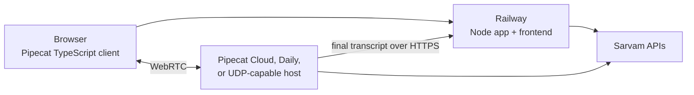

# Realtime voice deployment

## What is JavaScript/TypeScript, and what is Python?

The browser side is already the official Pipecat TypeScript stack:

- `@pipecat-ai/client-js`
- `@pipecat-ai/small-webrtc-transport`
- `landing-page/src/try/TryPageRealtime.tsx`

It handles microphone devices, WebRTC signaling, bot events, audio levels,
interruptions, and speaker playback.

Pipecat's supported server runtime is Python. `realtime/bot.py` owns the live
audio pipeline: Silero VAD, Sarvam streaming STT/TTS, turn boundaries, and
interruption cancellation. It sends each final transcript to
`app/server.js`, so memory, safety, prompts, and session state still have one
source of truth.

Rewriting the server in TypeScript would mean replacing Pipecat's server
runtime, not merely changing SDK syntax. That would make the system harder to
maintain and lose the framework behavior we chose Pipecat for.

## Local test

```bash
# Terminal 1: Node API and built frontend
npm start

# Terminal 2: Pipecat server
npm run realtime
```

Create `landing-page/.env.local`:

```dotenv
VITE_REALTIME_URL=http://localhost:7860
```

If Vite is being used, restart it after changing the variable. Open
`http://localhost:3000/#/try` for the built site or the Vite URL for local
frontend development.

## Recommended production shape



### Recommended: Railway + managed realtime

Keep the Node app, frontend, SQLite volume, and product APIs on Railway. Put
the realtime Pipecat worker on Pipecat Cloud or use Pipecat's Daily transport.
Those services handle the public WebRTC media edge; the bot calls the Railway
API over HTTPS.

This requires a production transport/start-session adapter because the
current runner is intentionally SmallWebRTC-only. Do not set
`VITE_REALTIME_URL` in production until that adapter is deployed and its public
start endpoint is known. With the variable unset, the existing REST voice loop
continues to work.

### Self-hosted option: Railway + a UDP-capable container host

`realtime/Dockerfile` packages the current SmallWebRTC worker. Run it on a host
that exposes WebRTC UDP, such as a VM or a UDP-capable container platform.

Build it locally with:

```bash
docker build -t yaadein-realtime ./realtime
docker run --rm -p 7860:7860 \
  -e SARVAM_API_KEY \
  -e YAADEIN_API_BASE=https://your-node-service.up.railway.app \
  yaadein-realtime
```

Then set this build variable on the Railway web service and rebuild:

```dotenv
VITE_REALTIME_URL=https://your-realtime-domain.example
```

### Why not host direct SmallWebRTC on Railway?

Railway is suitable for the signaling HTTP endpoint and supports multiple
services, private networking, WebSockets, domains, Dockerfiles, and health
checks. Its public edge exposes HTTP/HTTPS and TCP, but not inbound UDP.
SmallWebRTC media therefore cannot reliably reach a Railway container directly.

An external TURN service over TCP/TLS can relay media, but both the browser and
server ICE configuration must be wired to it and the relay adds cost and
latency. For this product, a managed WebRTC transport or a UDP-capable worker
host is the cleaner production choice.

## Environment variables

### Railway web service

```dotenv
SARVAM_API_KEY=...
VITE_REALTIME_URL=https://public-realtime-endpoint.example
```

`VITE_REALTIME_URL` is compiled into the browser bundle, so changing it requires
a frontend rebuild.

### Realtime worker

```dotenv
SARVAM_API_KEY=...
YAADEIN_API_BASE=https://your-node-service.up.railway.app
PORT=7860
```

The realtime worker must use the public Railway URL when it runs outside the
Railway project. A browser can never use `*.railway.internal`.

## Railway service checklist

For the existing Node service:

1. Keep the repository root as the service root.
2. Build with `npm run build`.
3. Start with `npm start`.
4. Mount the persistent volume at the current app data path.
5. Generate a public domain and keep the existing health/attack checks.
6. Add `VITE_REALTIME_URL` only after the realtime endpoint is live.

Do not deploy the realtime Dockerfile as a plain public SmallWebRTC Railway
service unless an external TURN configuration has been added and tested.
