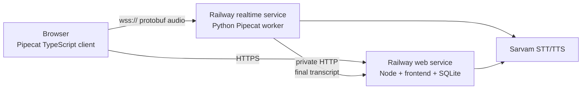

# Self-hosted realtime voice on Railway

## Architecture

Yaadein uses the official Pipecat stack on both sides:

- Browser: TypeScript `@pipecat-ai/client-js` and
  `@pipecat-ai/websocket-transport`
- Realtime worker: Python Pipecat, Silero VAD, and Sarvam streaming STT/TTS
- Product backend: Node, SQLite, prompts, memory, and safety



The browser sends microphone PCM and receives bot PCM over one WebSocket.
Pipecat still owns turn detection, interruptions, STT, and TTS. Only the
transport changed from direct SmallWebRTC to WebSockets.

This fits Railway because its public edge supports WebSockets. It does not
require public inbound UDP, TURN, Pipecat Cloud, or Daily.

## Why TypeScript does not replace the Python worker

Pipecat's TypeScript SDK is the browser client. It manages microphone devices,
speaker playback, connection state, audio levels, and RTVI messages.

Pipecat's supported agent pipeline is Python. Rewriting the worker in
TypeScript would mean replacing Pipecat's VAD, interruption, frame, STT, and
TTS pipeline rather than changing SDK syntax.

## Local test

Create `app/.env`:

```dotenv
SARVAM_API_KEY=...
```

Create `landing-page/.env.local`:

```dotenv
VITE_REALTIME_URL=http://localhost:7860
```

Build after changing a Vite variable:

```bash
npm run build
```

Run the two processes:

```bash
# Terminal 1
npm start

# Terminal 2
npm run realtime
```

Open `http://localhost:3000/#/try`.

## Railway project

Create two services from the same GitHub repository and the same environment.

### Service 1: `yaadein-web`

- Root directory: `/`
- Build command: `npm run build`
- Start command: `npm start`
- Public domain: enabled
- Persistent volume: mounted at the existing app data path

Keep the existing product variables, including `SARVAM_API_KEY`.

After the realtime service has a public domain, add this build variable and
redeploy the web service:

```dotenv
VITE_REALTIME_URL=https://${{yaadein-realtime.RAILWAY_PUBLIC_DOMAIN}}
```

`VITE_REALTIME_URL` is compiled into the browser bundle, so changing it always
requires a rebuild.

### Service 2: `yaadein-realtime`

- Root directory: `/realtime`
- Config file path: `/realtime/railway.json`
- Builder: `realtime/Dockerfile`
- Public domain: enabled
- No volume required

Variables:

```dotenv
SARVAM_API_KEY=${{yaadein-web.SARVAM_API_KEY}}
YAADEIN_API_BASE=http://yaadein-web.railway.internal:${{yaadein-web.PORT}}
```

Use `http`, not `https`, for Railway private networking. The browser must use
the realtime service's public domain; only the worker-to-Node request uses the
private domain.

## Session flow

1. The browser asks Node to create a Yaadein session.
2. Node returns an unguessable session ID and the caption shown on screen.
3. The TypeScript client connects to `/ws-client?sessionId=...`.
4. The Python worker retrieves the opener and language from Node over private
   networking.
5. The worker speaks the opener and streams turns over the WebSocket.
6. Final transcripts go through the existing Node memory and safety pipeline.

Only the random session ID enters the WebSocket URL. Generated conversation
text and API keys do not enter URLs or browser-visible configuration.

## Operational tradeoffs

WebSockets make Railway self-hosting simple and remove Pipecat Cloud hosting
charges. Railway compute and Sarvam usage still apply.

Compared with WebRTC, WebSocket audio runs over TCP. On lossy mobile networks,
packet retransmission can add jitter or latency. Browser microphone echo
cancellation and noise suppression still apply, but WebRTC's media-specific
congestion handling is not present. Test on the actual mobile network before
making realtime the only production voice path.

The REST voice implementation remains the automatic fallback whenever
`VITE_REALTIME_URL` is unset.
